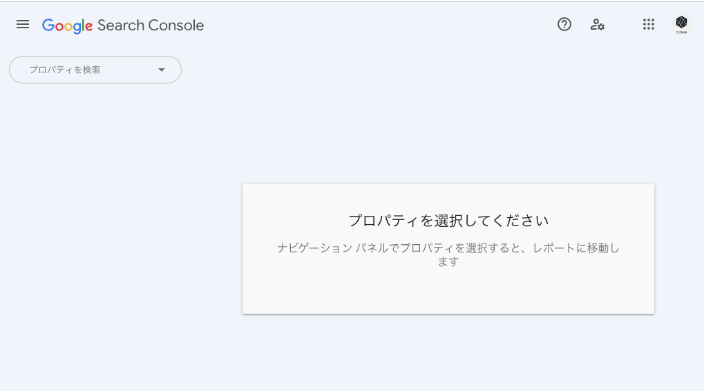
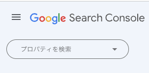
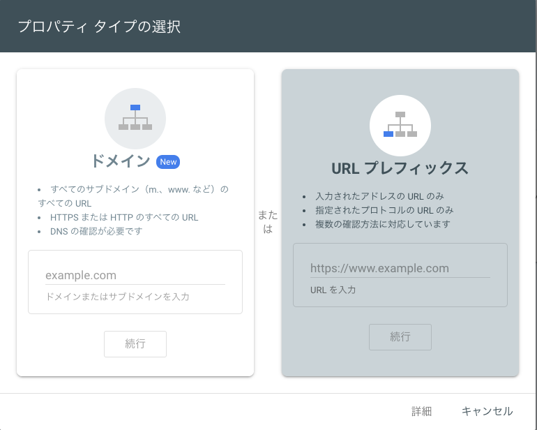
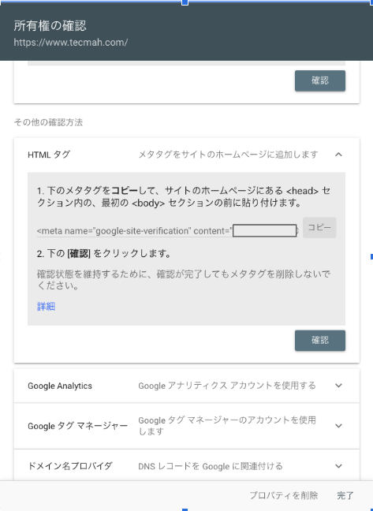

#　HexoでgoogleSerchConsoleに登録したい！


## Google Search Consoleにアクセス

Googleアカウントでログインし、[Google Search Console](https://search.google.com/search-console/performance/search-analytics)にアクセスします。


## ウェブサイトのプロパティを追加
左上の「プロパティの追加」をクリックし、自分のウェブサイトのURLを入力します。ウェブサイトのURLは、「http://」または「https://」から始まり、最後に「/」が必要です。



URLプレフィックスを選択して、自分のサイトのURLを貼り付けます


## HTMLタグによる所有権の確認 
所有権の確認方法の中から「HTMLタグ」を選択します。
これは、ウェブサイトのヘッドセクションに特定のメタタグを追加することによってウェブサイトの所有権を確認します。


## HTMLタグをHexoのテーマに追加:
Google Search Consoleから提供されたHTMLタグをコピーします。次に、Hexoのテーマファイルに移動し、このHTMLタグを「head.ejs」または「layout.ejs」の<head>セクションにペーストします。

たとえば、themes/your-theme/layout/_partial/head.ejsの中に、以下のようにHTMLタグを追加します：

```html
Copy code
<meta name="google-site-verification" content="your_google_verification_code" />
```

ここで "your_google_verification_code" の部分はGoogle Search Consoleから提供されたHTMLタグの内容に置き換えてください。

## Hexoをデプロイ:
変更を保存した後、hexo generateおよびhexo deployコマンドを使用してHexoをデプロイします。これにより、変更内容がライブウェブサイトに反映されます。

## 所有権の確認を実行:
Google Search Consoleに戻り、「確認」ボタンをクリックして所有権の確認を行います。成功すれば、Google Search Consoleのダッシュボードにあなたのサイトが表示され、サイトのデータ分析を開始することができます。

使用しているテーマや設定によっては、異なる手順が必要になることがあります。


    