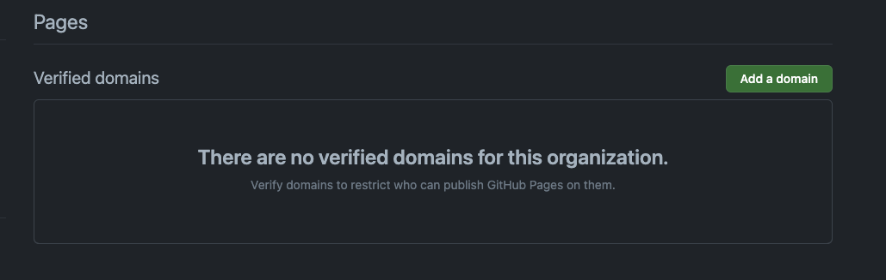
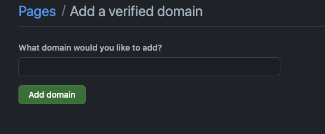

# HexoでGitHub Pagesにカスタムドメインを設定する

HexoでGitHub Pagesにカスタムドメインを設定する手順になります。

## 1. ドメインを購入する

まずはじめに、自分のウェブサイトに使用したいドメインを購入します。
ドメインは、GoDaddy、Namecheap、Google Domainsなどのプロバイダから購入できます。
自分が使っているのは日本のお名前.COMです。
なんといっても他のプロバイダより休めに購入できます。

## 2. DNS設定を行う

ドメインを購入したら、ドメインのDNS設定を行います。DNS設定はドメインプロバイダの管理画面から行うことができます。

GitHub Pagesを使用している場合、以下のように設定します。

- Aレコード：185.199.108.153
- Aレコード：185.199.109.153
- Aレコード：185.199.110.153
- Aレコード：185.199.111.153

## 3. リポジトリにCNAMEファイルを追加する

次に、GitHubのリポジトリにCNAMEという名前のファイルを作成します。このファイルの中には、設定したいドメイン名を記述します。

例えば、`example.com`というドメインを設定したい場合、CNAMEファイルの中身は以下のようになります。

```
example.com
```

このCNAMEファイルをリポジトリのルートディレクトリに追加します。

## 4. Hexoの設定を変更する

最後に、Hexoの設定ファイル`_config.yml`を開き、`url`の部分を新しいドメインに変更します。

```yaml
# URL
## If your site is put in a subdirectory, set url as 'http://yoursite.com/child' and root as '/child/'
url: http://example.com
root: /
```

## 5. 変更をデプロイする

以上の変更を行ったら、最後にHexoを使ってサイトを再生成し、変更をデプロイします。

```bash
$ hexo clean
$ hexo generate
$ hexo deploy
```

これで、新しいドメインでHexoのウェブサイトが表示されるようになります。
なるはずです。


# ４０４エラーが出る

** 全然ダメじゃねぇか！！！！！！！！！


## エラーの原因を調べる

そもそもCostomDomainの設定でDNSをチェックしてほしいと表示されている。


DNS Check in Progressは何を指しているのか
考えられる原因は以下のどれかかも
- AレコードやCNAMEレコードが正しく設定されていない。
- DNSの変更がまだ完全にプロパゲート（伝播）されていない。
- ドメインが他のサービスにもマッピングされていて、競合が発生している。

 AレコードやCNAMEレコードが正しく設定されていないのかもしれない、
初期でこのページ作ったけどもう三年も前だしな・・・・

# GithubのOrganaizationでカスタムドメインが設定できるようになっている。

[Organizationのサイトのドメインの検証](https://docs.github.com/ja/pages/configuring-a-custom-domain-for-your-github-pages-site/verifying-your-custom-domain-for-github-pages)

Organizationのオーナーは、自分のOrganizatinのカスタムドメインを検証できます。
GitHub.com の右上隅にあるプロファイル写真をクリックし、 [自分の Organization] をクリックします。
組織の隣の [設定] をクリックします。
サイドバーの [コード、計画、自動化] セクションで、 [ Pages] をクリックしてください。
右側の [ドメインの追加] をクリックします。
[追加するドメイン] で、確認するドメインを入力し、 [ドメインの追加] を選びます。
[DNS TXT レコードを追加する] の手順に従って、ドメイン ホスティング サービスで TXT レコードを作成します。
DNS 構成が変わるまで待ちます。 即時または最大 24 時間かかる場合があります。
DNS 構成が更新されたことを確認したら、ドメインを確認できます。
自分のドメインを確認するには、 [確認] をクリックします。

## OrganizationのVerified domainsの設定を行う

現状ではVerified domains無い


設定を開始してAdd dmainを行う。



# お名前.comでDNS設定の追加

お名前.comのDNSの設定に追加、これでDNSの変更はいいはず？


#　githubに戻ってVarify
設定を追加して変更・・・・したが２４時間変更にかかる場合があるとのこと
こればっかりは待つしかない。


## 雲行きが怪しいのでClaudFlareを見にいく

いくら待っても全然通らない、流石におかしいぞ・・・・
[cloudflare](https://www.cloudflare.com/)
で以前設定を行なっていたか、確認。

- なんかありますねぇ！!!!!!!!


DNSの設定をcloudflareで行ったらいけました。


# HTTPSの問題が出る


# デプロイの問題も出ている。

Your site was last deployed to the github-pages environment by the pages build and deployment workflow.
Learn more about deploying to GitHub Pages using custom workflows


# CNAMEの管理も場所がおかしい
Hexoでは、ビルドの際にsources内の.md以外のファイルはそのままpublicディレクトリにコピーされるので
これを利用して、GitHub Pagesでカスタムドメインを設定するときに必要なCNAMEファイルをsources直下に
追加しなければなりません。


# 小文字大文字

404エラーはGitがデフォルトでは大文字・小文字を区別しないことに起因していました。
https://sishida21.github.io/2020/06/01/solve-page-404-error-in-hexo/

```
404
ファイルが見つかりません
このアドレスに設定されているサイトには、要求されたファイルが含まれていません。
これが自分のサイトの場合は、ファイル名の大文字と小文字が URL およびファイルのアクセス許可と一致していることを確認してください。
ルート URL ( などhttp://example.com/) の場合は、index.htmlファイルを指定する必要があります。
GitHub Pages の使用方法の詳細については、完全なドキュメントをお読みください。
```


対応コマンド
```
cd .deploy_git 
git rm -rf *
hexo deploy -g

```

https://qiita.com/simochee/items/58f04385713dd65f69f5


以上が、HexoでGitHub Pagesにカスタムドメインを設定する手順です。
ドメインプロバイダやDNS設定の詳細はプロバイダにより異なるため、
具体的な操作はプロバイダのドキュメンテーションやヘルプを参照してください。


# git stashに関しての記事
git stash 
git stash list
git stash apply stash@{2}
https://qiita.com/negi/items/291f5dc93750d3b15e0d

git 一旦整理
